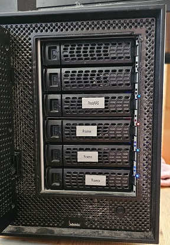

# zfs-zed.d-script

# Usage
`statechange-ledctl.sh` goes into /etc/zfs/zfs.d  
Don't forget to `HUP` `zed`  
Tested on Proxmox 7.4-3

# Testing
```
# zpool status
(... pick a drive ...)
# zpool offline -f rpool chosen-drive
(... see correct led go red ...)
# zpool clear rpool chosen-drive; zpool onnline rpool chosen-drive
```

# Showing

